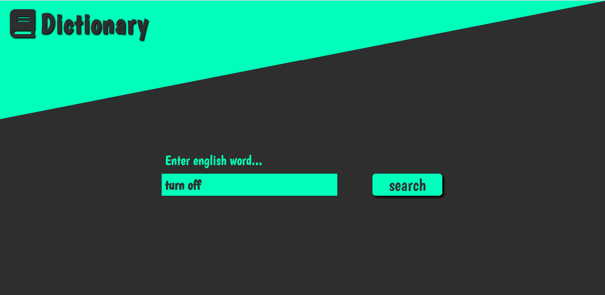

# Dictionary



 [Click and check it!](https://maciejspalek.github.io/Dictionary/)

 ## About the project 
The application for learning English, allowing you to find word’s definitions, parts of speech and pronunciation in written and audio. It based on dictionary API (www.dictionaryapi.com).


 ## The project created with 
 * HTML
 * BEM
 * CSS + SASS
 * JS + jQuery
 * Responsive Web Design
 * Working with API


## Usage

```
npm start
```